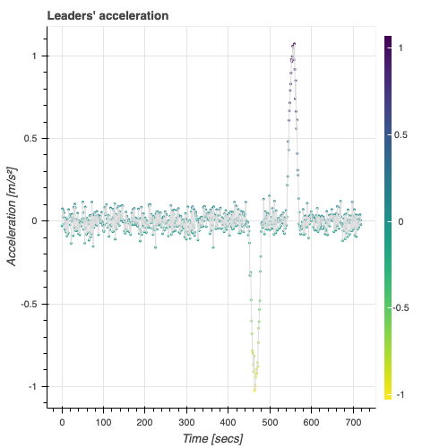
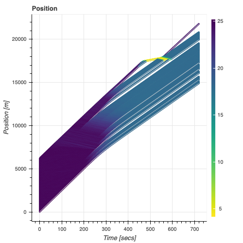
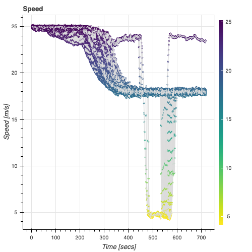
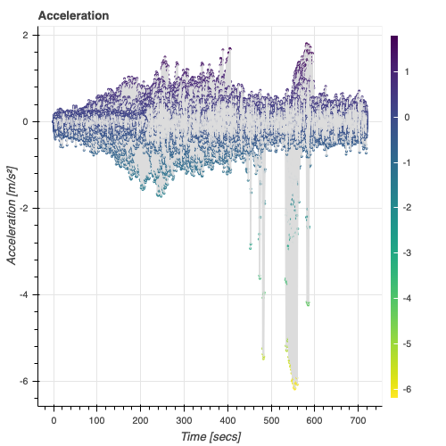

**| [Overview](#overview) | [Reproducibility](#reproducibility) | [License](#license) | [Contact](#contact) |**

## <span style="color:red"> New information </span>

* Launch new simulations[here](https://mybinder.org/v2/gh/aladinoster/v2v-test.git/test?filepath=General.ipynb)

# Scoop Demo 

[](https://mybinder.org/v2/gh/aladinoster/v2v-test.git/master?filepath=General.ipynb)

## Overview

The following not is oriented to reproduce and simulate some effects of sending messages from infrastructure to connected vehicles. 

* The following results are reproducible by executing instructions in the [Jupyter Notebook ](General.ipynb). 

|Traffic Dynamic Response |                          |
:-------------------------|:-------------------------
  |  
  |  

## Reproducibility

Download this repository

```{bash}
git clone https://github.com/aladinoster/wave-congestion-absorption.git
```

Be sure to get [conda](https://www.anaconda.com/distribution/), then:

```{bash}
conda env create -f environment.yml
conda activate v2vcflaw
jupyter labextension install jupyterlab_bokeh
jupyter lab General.ipynb
```

## License

The code here contained is licensed under [MIT License](LICENSE)

## Contact 

If you run into problems or bugs, please let us know by [creating an issue](https://github.com/aladinoster/wave-congestion-absorption/issues/new) an issue in this repository.